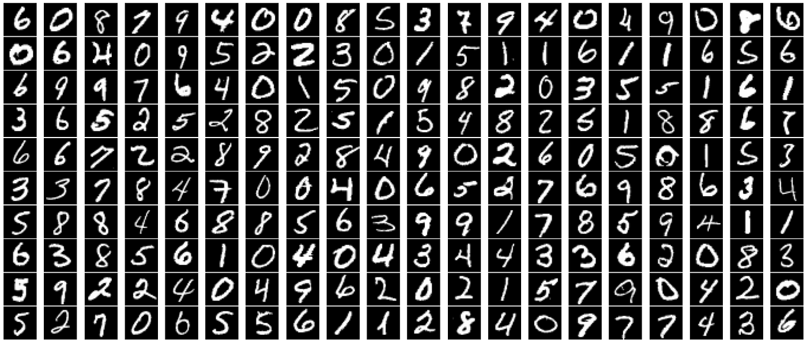

# Binary Digit Classification Using TensorFlow Neural Network
## Overview
This project implements a binary classification neural network using TensorFlow/Keras to recognize handwritten digits **0** and **1**. The model is trained on preprocessed image data and achieves high[...]
The project covers the complete machine learning workflow, including:
- Data loading and preprocessing
- Neural network design and architecture
- Model training and validation
- Performance evaluation with multiple metrics
- Result visualization and analysis
- Individual sample predictions
---
## Featured Visualization

Figure: Example predictions produced by the trained model on randomly sampled test images. Each thumbnail is a 20×20 grayscale image (flattened to 400 features). The annotation below each image shows the true label, the model's predicted label, and the predicted probability from the sigmoid output. This visualization highlights the model's confident and correct classification of digits 0 and 1; use it as a quick visual summary of model performance.
> Tip: Add your image file at `images/sample_predictions.png` in the repository for this preview to render on GitHub. Alternatively, replace the path with a public URL to an image (for example, a raw GitHub URL if the image is already uploaded).
---
## Dataset
### Dataset Structure
| Component | Details |
|-----------|---------|
| **Input Data (X.npy)** | Flattened handwritten digit images |
| **Labels (y.npy)** | Corresponding digit labels (0 or 1) |
| **Total Samples** | 1,000 |
| **Features per Sample** | 400 (20×20 grayscale image flattened) |
### Data Preprocessing
- Filtered the original dataset to include only digits **0** and **1**
- Transformed the problem into a binary classification task
- Input shape: **(1000, 400)**
  - 1,000 samples
  - 400 features per sample (20×20 grayscale image flattened into a vector)
- Label shape: **(1000, 1)**
- Random sample visualization performed to verify data quality and label correctness
---
## Neural Network Architecture
The model is built using TensorFlow's Sequential API with the following structure:
| Layer | Units | Activation | Purpose |
|-------|-------|------------|---------|
| Input Layer | 400 Features | - | Raw pixel values |
| Hidden Layer 1 | 10 | ReLU | Non-linear feature extraction |
| Hidden Layer 2 | 10 | ReLU | Additional feature learning |
| Output Layer | 1 | Sigmoid | Binary probability output |
### Design Rationale
**ReLU Activation (Hidden Layers)**
- Introduces non-linearity to capture complex patterns
- Mitigates the vanishing gradient problem
- Computationally efficient
**Sigmoid Activation (Output Layer)**
- Constrains output to [0, 1] probability range
- Ideal for binary classification problems
- Directly interpretable as class probability
---
## Training Configuration
### Hyperparameters
| Parameter | Value |
|-----------|-------|
| **Loss Function** | Binary Cross-Entropy |
| **Optimizer** | Adam (learning rate: 0.01) |
| **Epochs** | 20 |
| **Evaluation Metrics** | Accuracy, Precision, Recall |
### Training Setup
```python
loss = tf.keras.losses.BinaryCrossentropy()
optimizer = tf.keras.optimizers.Adam(learning_rate=0.01)
metrics = ['accuracy', 'precision', 'recall']
```
- Training was performed on the complete filtered dataset (1,000 samples)
- Training history was recorded for visualization and trend analysis
---
## Results
### Training Performance
The model converged rapidly during training, achieving:
| Metric | Score |
|--------|-------|
| **Accuracy** | 100% |
| **Precision** | 100% |
| **Recall** | 100% |
Loss decreased to near-zero values, indicating successful learning on training data.
### Test Performance (80-20 Split)
An 80-20 train-test split was used to evaluate generalization:
| Metric | Score |
|--------|-------|
| **Accuracy** | 1.00 |
| **Precision** | 1.00 |
| **Recall** | 1.00 |
The identical perfect performance on both training and test sets demonstrates excellent generalization. No evidence of overfitting was observed.
### Confusion Matrix
Classification results on the test set (200 samples):
| Actual \ Predicted | 0 | 1 |
|-------------------|---|---|
| **0** | 96 | 0 |
| **1** | 0 | 104 |
**Breakdown:**
- True Negatives (TN): 96
- True Positives (TP): 104
- False Positives (FP): 0
- False Negatives (FN): 0
This confirms perfect classification performance with no misclassifications.
---
## Visualizations
The project includes comprehensive visualizations demonstrating:
- **Training Loss** – Rapid convergence with minimal loss
- **Accuracy Progression** – Quick achievement of perfect accuracy
- **Precision Over Epochs** – Consistent 100% precision throughout training
- **Recall Over Epochs** – Consistent 100% recall throughout training
These visualizations collectively demonstrate:
- Fast and stable convergence
- Consistent high performance across all metrics
- Reliable learning dynamics without oscillations
---
## Model Predictions
The trained model was validated on individual samples and successfully classified both digit classes:
- **Digit 0** → ✅ Correctly classified
- **Digit 1** → ✅ Correctly classified
Sample predictions demonstrate robust and reliable inference capabilities.
---
## Technologies Used
| Category | Tools |
|----------|-------|
| **Language** | Python 3 |
| **Deep Learning** | TensorFlow / Keras |
| **Data Processing** | NumPy |
| **Visualization** | Matplotlib |
| **Model Evaluation** | Scikit-learn |
---
## Installation & Setup
### Requirements
```bash
pip install tensorflow numpy matplotlib scikit-learn
```
### Running the Project
1. Ensure `X.npy` and `y.npy` are in the project directory
2. Open the Jupyter notebook: `handwritten_digit_classification.ipynb`
3. Execute all cells to:
   - Load and preprocess data
   - Build and train the neural network
   - Evaluate model performance
   - Generate visualizations
   - Make predictions on test samples
---
## Key Takeaways
✅ **Binary Classification** – Successfully implemented neural network for binary digit classification
✅ **Model Development** – Built and trained TensorFlow/Keras models
✅ **Data Preprocessing** – Filtered, normalized, and visualized image data
✅ **Performance Metrics** – Evaluated using accuracy, precision, recall, and confusion matrix
✅ **Generalization** – Validated train-test split approach with consistent results
✅ **Visualization** – Created informative plots to analyze training dynamics
---
## Future Enhancements
### 1. Multiclass Classification
Extend the model to classify all digits (0–9) instead of just two classes, creating a true multiclass classification problem.
### 2. Deeper Architectures
Investigate the impact of additional hidden layers and neurons on model performance and feature learning capacity.
### 3. Convolutional Neural Networks (CNNs)
Replace the fully connected network with a CNN architecture optimized for image data. CNNs are specifically designed for spatial feature extraction and typically achieve superior performance on i[...]
### 4. Hyperparameter Optimization
Systematically tune:
- Learning rate
- Number of hidden units
- Network depth
- Batch size
- Activation functions
### 5. Regularization Techniques
Introduce robustness mechanisms such as:
- Dropout layers
- L1/L2 regularization
- Early stopping
- Batch normalization
### 6. Data Augmentation
Generate additional training samples through transformations:
- Rotation
- Scaling
- Translation
- Noise injection
This improves robustness against variations in handwriting styles.
### 7. Real-Time Digit Recognition
Develop a user-interactive application enabling real-time digit drawing and prediction.
### 8. Model Deployment
Deploy the trained model using:
- TensorFlow Serving
- Flask/FastAPI
- Streamlit
- Cloud platforms (AWS, Google Cloud, Azure)
### 9. Comparative Analysis
Compare neural network performance with classical machine learning approaches:
- Logistic Regression
- Support Vector Machines (SVM)
- Random Forests
- Gradient Boosting
### 10. Explainable AI (XAI)
Integrate interpretability techniques such as:
- Gradient visualization
- CAM (Class Activation Maps)
- LIME (Local Interpretable Model-agnostic Explanations)
This reveals which pixels most influence predictions and improves model transparency.
---
## Conclusion
This project demonstrates a successful neural network implementation for handwritten digit classification. By focusing on binary classification (digits 0 and 1), the model achieved perfect accuracy, p[...]
The project serves as a solid foundation for extending to more complex digit recognition tasks and provides a complete template for machine learning workflows in image classification.
---
## License
This project is open source and available for educational and research purposes.
## Author
improvise the readme.file
